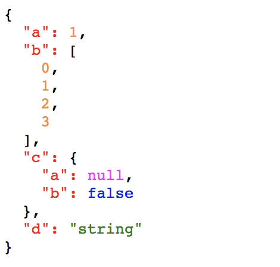

# json-displayer

> json-displayer is displayer for json in vue with indent, and syntax highlight.



## Installation
To install the module simply run:
```javascript
npm install json-display
```
## Usage

```javascript
  import JsonDisplayer from 'json-displayer'

  export default {
    ……
    data() {
      return {
        json: {
          a: 1,
          b: [0, 1, 2, 3],
          c: {
            a: null,
            b: false
          },
          d: 'string'
        }
      }
    },
    components: { JsonDisplayer }
    ……
  }
```

```
<json-displayer :json="json"/>
```

## Props


| Name | Required | Default | Type | Description
| ---: | :----: | :------- | ---- | ---- |
|   json  | Yes | - | Object | Json is the object need to display |
